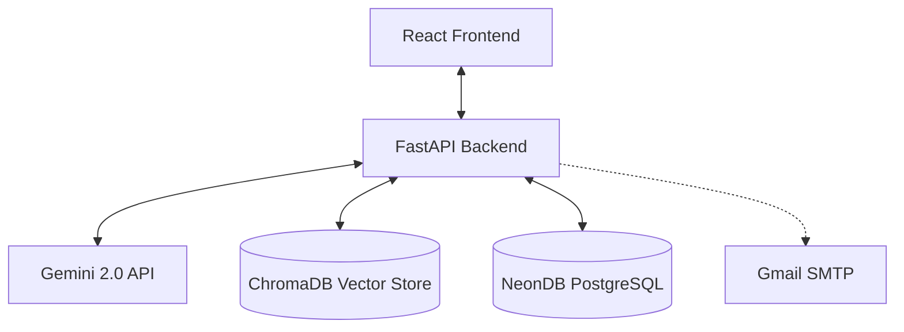
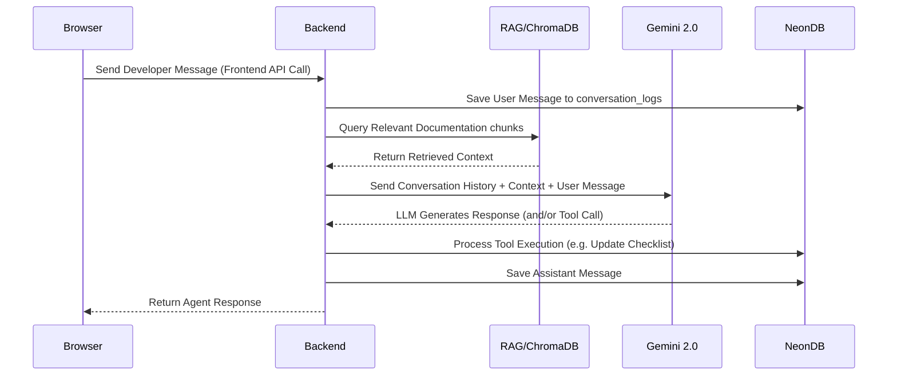
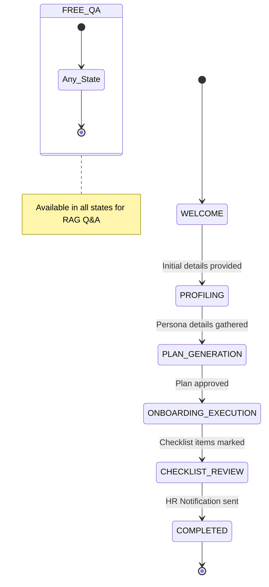

# Architecture Diagrams

## System Overview Diagram

```mermaid
graph TD
    UI[React Frontend] <--> API[FastAPI Backend]
    API <--> LLM[Gemini 2.0 API]
    API <--> VDB[(ChromaDB Vector Store)]
    API <--> RDB[(NeonDB PostgreSQL)]
    API -.-> SMTP[Gmail SMTP]
```

## Data Flow Diagram

```mermaid
sequenceDiagram
    participant Browser
    participant Backend
    participant Retrieval as RAG/ChromaDB
    participant Gemini as Gemini 2.0
    participant DB as NeonDB

    Browser->>Backend: Send Developer Message (Frontend API Call)
    Backend->>DB: Save User Message to conversation_logs
    Backend->>Retrieval: Query Relevant Documentation chunks
    Retrieval-->>Backend: Return Retrieved Context
    Backend->>Gemini: Send Conversation History + Context + User Message
    Gemini-->>Backend: LLM Generates Response (and/or Tool Call)
    Backend->>DB: Process Tool Execution (e.g. Update Checklist)
    Backend->>DB: Save Assistant Message
    Backend-->>Browser: Return Agent Response
```

## FSM State Diagram

```mermaid
stateDiagram-v2
    [*] --> WELCOME
    WELCOME --> PROFILING : Initial details provided
    PROFILING --> PLAN_GENERATION : Persona details gathered
    PLAN_GENERATION --> ONBOARDING_EXECUTION : Plan approved
    ONBOARDING_EXECUTION --> CHECKLIST_REVIEW : Checklist items marked
    CHECKLIST_REVIEW --> COMPLETED : HR Notification sent
    COMPLETED --> [*]

    state FREE_QA {
        [*] --> Any_State
        Any_State --> [*]
    }
    
    note right of FREE_QA: Available in all states for RAG Q&A
```
